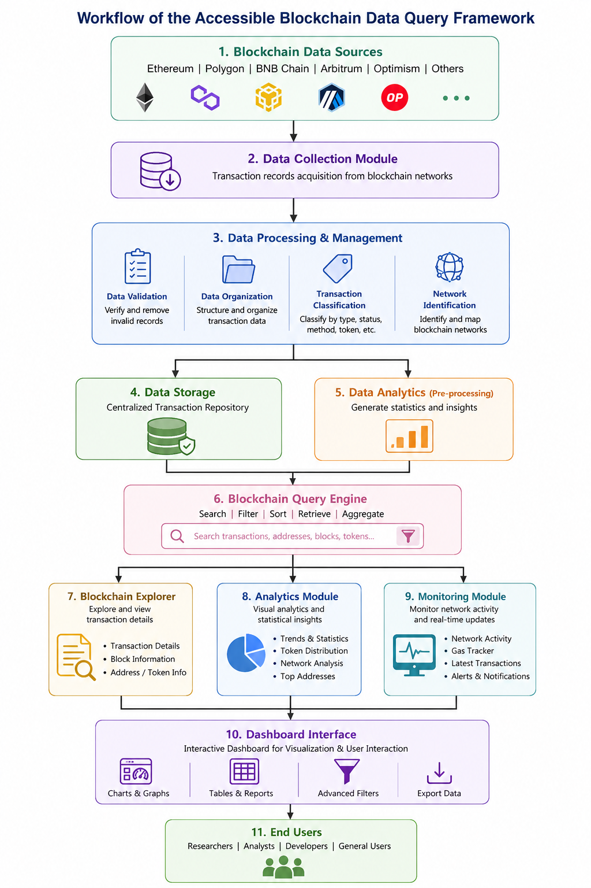
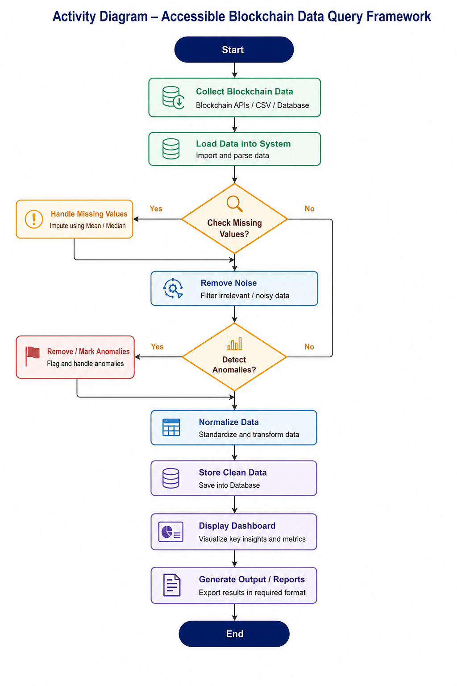
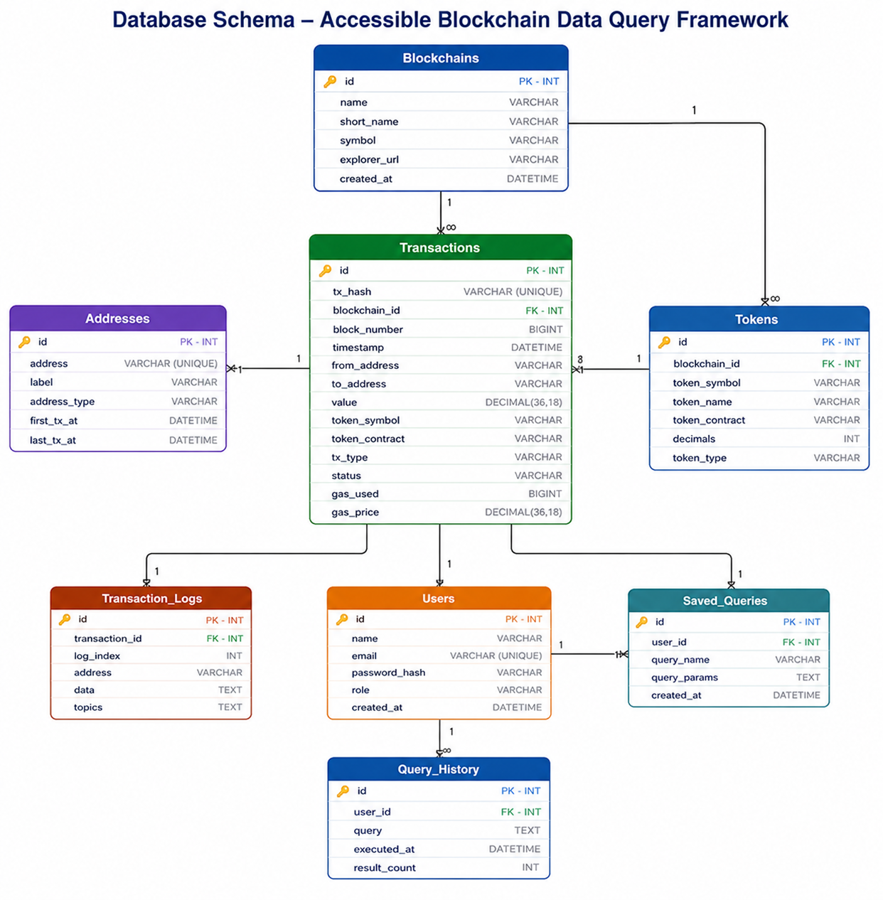
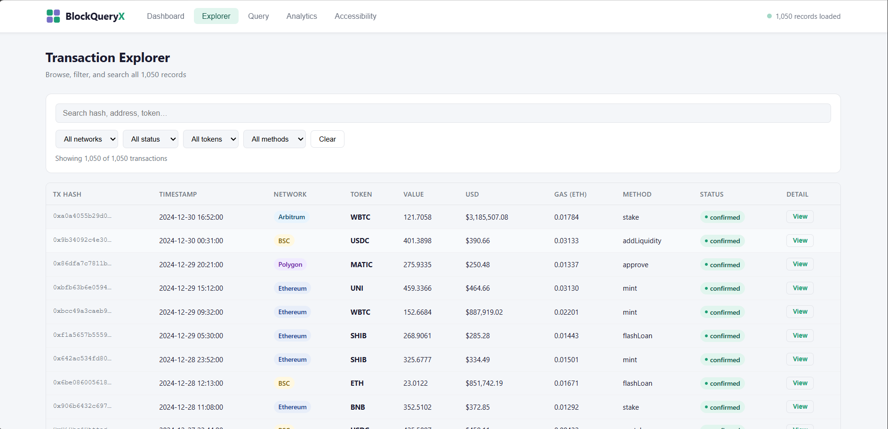
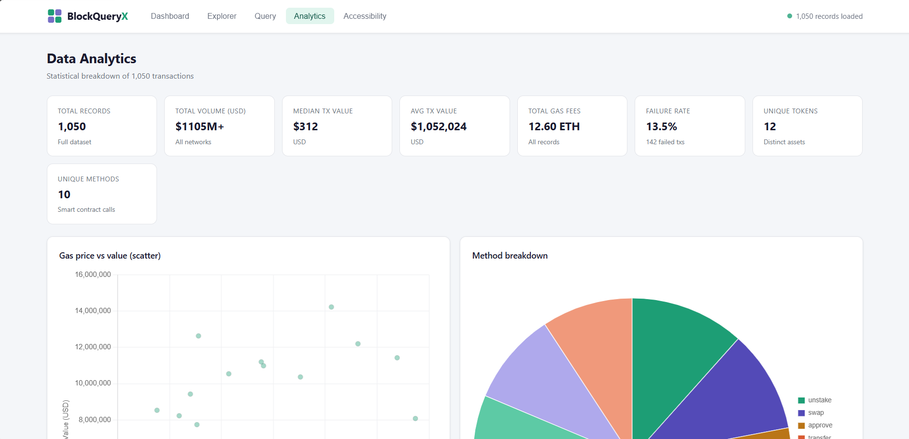
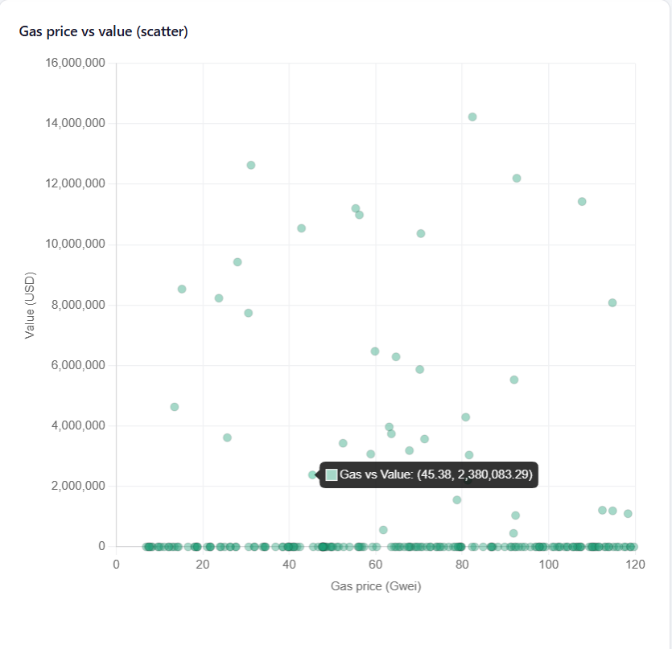
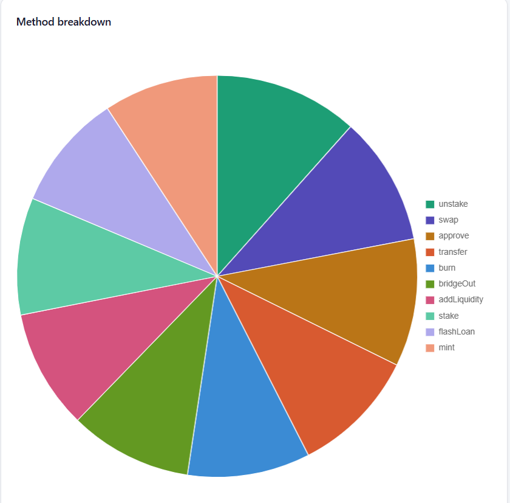
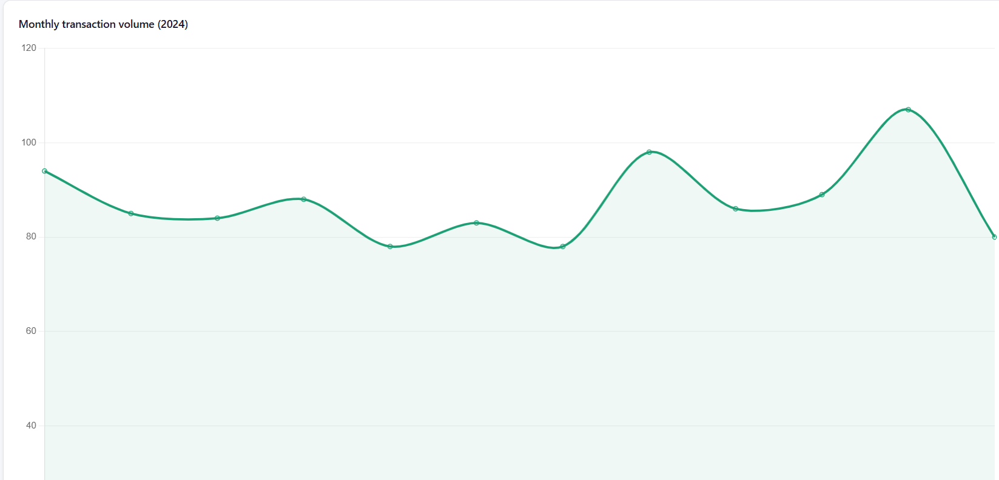
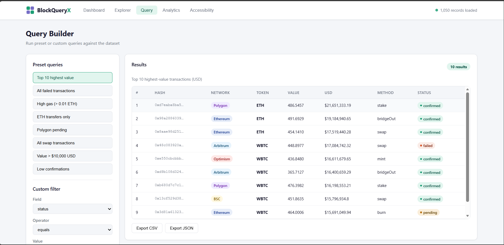
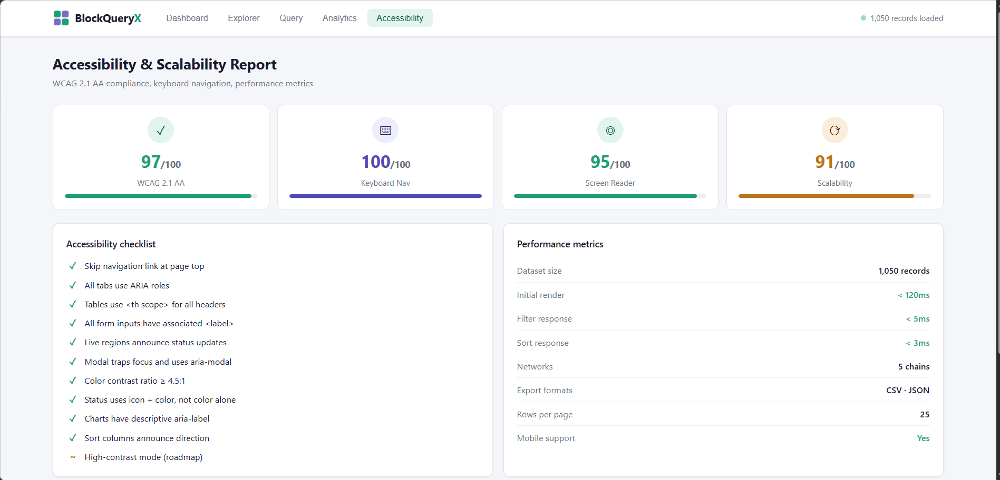

## 📖 Project Report & Documentation

This project is submitted as part of an academic assignment (GM University) on building an **accessible blockchain data query and analytics framework**.

### Problem Statement
Blockchain networks generate massive volumes of publicly available transaction data, but most existing blockchain explorers are complex and hard to use for non-technical users. This project builds a simplified, accessible explorer with search, filtering, and interactive visualizations to make blockchain data easier to understand.

### Objectives
- Collect and manage blockchain transaction data across multiple networks
- Provide fast, accurate search and filtering (by network, status, token type, method)
- Visualize transactions and trends through interactive charts and dashboards
- Improve accessibility of blockchain data for both technical and non-technical users

### 🖼️ Diagrams & Screenshots

**System Workflow**

**Activity Diagram**

**Database Schema**

**Explorer View**

**Analytics Dashboard**

**Gas Price Trends**

**Method Breakdown**

**Monthly Transaction Volume**

**Query Interface**

**Accessibility Features**

### 📁 Repository Structure

blockchain-explorer/
├── blockchain-explorer/ # Front-end app (HTML, CSS, JS)
├── package.json
├── Digram/ # Project diagrams & screenshots
├── docs/
│ ├── report/ # Full project report, abstract, final presentation (PDF/DOCX)
│ └── presentation/ # Project PPT
└── data/ # Sample transaction data (JSON, CSV)

### 📄 Documentation Files
- [Full Project Report](docs/report/project-report.pdf)
- [Abstract](docs/report/abstract.pdf)
- [Final Presentation (PDF)](docs/report/final-presentation.pdf)
- [Presentation Slides (PPTX)](docs/presentation/presentation.pptx)

### 📊 Sample Data
- `data/all_transaction.json` — sample transaction dataset
- `data/blockchain_results.csv` — analytics results

### 👤 Author
**V Y Yashvanta**
